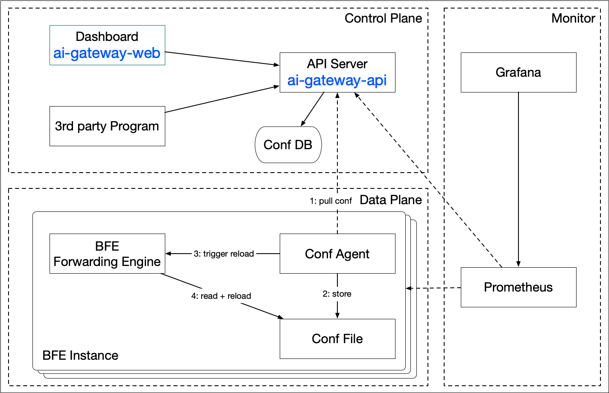

[](https://opensource.org/licenses/Apache-2.0)
[](https://go.dev/)

[English](README.md) | 简体中文

# AI Gateway

AI Gateway 是基于 [BFE](https://github.com/bfenetworks/bfe) 构建的开源 AI 流量网关，为多个 AI 模型提供商提供统一的 API 管理、认证、限流和智能路由能力，让开发者通过单一入口访问所有 AI 服务。

## 架构概述



AI Gateway 包含如下核心组件：

| 组件 | 角色 | 说明 | 仓库 |
|---|---|---|---|
| **AI Gateway API** | 控制面 | 对外提供 Open API，完成策略/配置的变更、存储和下发 | [yf-networks/ai-gateway-api](https://github.com/yf-networks/ai-gateway-api) |
| **Dashboard** | 管理控制台 | Web 可视化管理界面（内置在 API 镜像中） | [yf-networks/ai-gateway-web](https://github.com/yf-networks/ai-gateway-web) |
| **BFE** | 数据面 | 负责流量转发与接入控制 | [bfenetworks/bfe](https://github.com/bfenetworks/bfe) |
| **Conf Agent** | 配置代理 | 获取最新配置并触发 BFE 热加载 | [bfenetworks/conf-agent](https://github.com/bfenetworks/conf-agent) |
| **Service Controller** | 服务发现 | 发现并同步 K8s 后端服务（仅 K8s 部署） | [bfenetworks/service-controller](https://github.com/bfenetworks/service-controller) |

## 主要功能

- **AI 路由管理**：支持多 AI 模型提供商（OpenAI、DeepSeek、Anthropic、Google Gemini 等）的路由配置
- **API Key 管理**：AI 服务的 API Key 创建、删除与校验
- **域名管理**：域名绑定与路由规则配置
- **证书管理**：TLS 证书的上传与管理
- **集群/子集群管理**：后端服务集群的配置管理
- **流量管理**：流量分配与调度
- **Dashboard**：Web 可视化管理界面（内置在 API 镜像中）
- **配置导出**：为 BFE 数据面和 Conf Agent 提供配置导出接口

## 部署方式

AI Gateway 支持两种部署方式：

| 方式 | 命令 | 适用场景 |
|---|---|---|
| **容器部署** | `docker run` | 开发、演示、小规模部署 |
| **Kubernetes** | `kubectl apply -k kubernetes/` | 生产环境、集群部署 |

### 容器部署（All-in-One Docker）

单个容器集成 BFE + AI Gateway API + Conf Agent，支持数据库自动初始化。

**前置条件**：Docker、MySQL 8、Redis 6.2

```bash
# 拉取镜像
docker pull ghcr.io/yf-networks/ai-gateway:latest

# 准备配置文件（参见 conf/ 中的模板文件）
# 修改 conf/ai_gateway_api.toml 中的数据库连接信息

# 启动
docker run -d --name ai-gateway \
  -p 8080:8080 -p 8183:8183 \
  -v $(pwd)/conf/ai_gateway_api.toml:/home/work/api-server/conf/ai_gateway_api.toml \
  -v $(pwd)/conf/name_conf.data:/home/work/api-server/conf/name_conf.data \
  -v $(pwd)/conf/name_conf.data:/home/work/bfe/conf/name_conf.data \
  -v $(pwd)/conf/bfe.conf:/home/work/bfe/conf/bfe.conf \
  ghcr.io/yf-networks/ai-gateway:latest
```

访问 Dashboard：`http://localhost:8183`（admin / admin）

### Kubernetes

**前置条件**：kubectl >= 1.20，集群管理权限

```bash
# 一键部署所有组件
kubectl apply -k kubernetes/

# 验证
kubectl get pods -n ai-gateway-system
```

访问 Dashboard：`http://{NodeIP}:30183`（admin / admin）

完整部署指南及架构图请参阅 [Kubernetes 部署文档](./kubernetes/README.md)。

## 快速开始

### 1. 克隆仓库

```bash
git clone https://github.com/yf-networks/ai-gateway.git
cd ai-gateway
```

### 2. 修改配置

复制并编辑 `conf/` 目录下的配置文件：

| 文件 | 用途 |
|---|---|
| `conf/ai_gateway_api.toml` | 数据库、Redis 及 API Server 配置 |
| `conf/bfe.conf` | BFE 流量网关配置 |
| `conf/name_conf.data` | Redis 实例发现（API 与 BFE 共享） |

`conf/ai_gateway_api.toml` 示例（最少修改项）：

```toml
[Databases.bfe_db]
Addr   = "192.168.1.3:3306"      # MySQL 地址
User   = "root"                  # MySQL 用户名
Passwd = "your_password"         # MySQL 密码

[RedisConf]
Bns = "BFE.poc-redis-wx"         # Redis BNS 名称
```

`conf/name_conf.data` 示例（Redis 实例）：

```json
{
    "Version": "init version",
    "Config": {
        "BFE.poc-redis-wx": [{
            "Host": "192.168.1.4",
            "Port": 6379,
            "Weight": 10
        }]
    }
}
```

### 3. 选择部署方式

- **容器部署**：参见上方[容器部署](#容器部署all-in-one-docker)章节
- **Kubernetes**：参见上方[Kubernetes](#kubernetes)章节

## 从源码构建

从各组件的已发布镜像构建 all-in-one 镜像：

```bash
# 构建容器部署镜像
make docker-standalone

# 构建包含调试工具（curl、vim 等）的镜像
make docker-standalone VARIANT=debug

# 多架构推送
make docker-standalone-push REGISTRY=ghcr.io/your-org
```

**构建参数**：

| 参数 | 默认值 | 说明 |
|---|---|---|
| `BFE_IMAGE` | `ghcr.io/bfenetworks/bfe:v1.8.2` | BFE 镜像（提供 bfe + conf-agent） |
| `API_IMAGE` | `ghcr.io/yf-networks/ai-gateway-api:v0.0.2` | API Server 镜像（提供 api-server + dashboard） |
| `VARIANT` | `prod` | `prod` 或 `debug` |

## 版本管理

本仓库作为 AI Gateway 的**产品级版本入口**。`VERSIONS.yaml` 文件定义了各子组件之间的版本对照表：

```yaml
version: 0.2.0
components:
  bfe:
    version: v1.8.2
    source: image
    image: ghcr.io/bfenetworks/bfe:v1.8.2
    provides:
      - bfe
      - conf-agent
  ai-gateway-api:
    version: v0.0.2
    source: image
    image: ghcr.io/yf-networks/ai-gateway-api:v0.0.2
```

每个产品发版对应一组经过验证的组件版本组合。完整对照表参见 `VERSIONS.yaml`。

## 暴露端口

| 端口 | 组件 | 用途 |
|---|---|---|
| 8080 | BFE | HTTP 流量入口 |
| 8443 | BFE | HTTPS 流量入口 |
| 8421 | BFE | 监控端口 |
| 8183 | API Server | API 服务 + Dashboard |
| 8284 | API Server | 监控端口 |

## 贡献

欢迎贡献代码！请参阅 [CONTRIBUTING.md](./CONTRIBUTING.md) 了解开发流程和规范。

## 许可证

AI Gateway 基于 [Apache License 2.0](LICENSE) 发布。

## 参考资料

- [BFE](https://github.com/bfenetworks/bfe) — 数据面引擎
- [AI Gateway API](https://github.com/yf-networks/ai-gateway-api) — 控制面
- [AI Gateway Web](https://github.com/yf-networks/ai-gateway-web) — Dashboard 前端
- [Conf Agent](https://github.com/bfenetworks/conf-agent) — 配置代理
- [Service Controller](https://github.com/bfenetworks/service-controller) — K8s 服务发现
