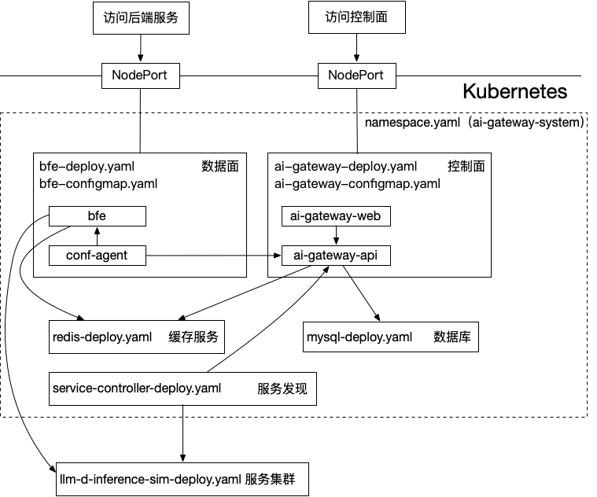

[English](README.md) | [简体中文](README_CN.md)

# AI Gateway Kubernetes Deployment

## Architecture



This deployment demonstrates the interaction of several key components in the `ai-gateway-system` namespace:

- **Data plane** (bfe with conf-agent): traffic forwarding and access control
- **Control plane** (ai-gateway-api): configuration/policy delivery API
- **Base dependencies** (MySQL, Redis): storage and dependency services
- **Service discovery** (service-controller): discovers and syncs backend services
- **Demo backend** (llm-d inference simulator): validates routing

Components communicate via Kubernetes Service/DNS:
- `ai-gateway-api.ai-gateway-system.svc.cluster.local`
- `mysql.ai-gateway-system.svc.cluster.local`
- `redis.ai-gateway-system.svc.cluster.local`

> Note: MySQL / Redis use `emptyDir` for storage in this example. Data will be lost on Pod restart. This is for demo/connectivity validation only.

## Manifest Overview

| File | Description |
|---|---|
| `namespace.yaml` | Namespace definition (ai-gateway-system) |
| `kustomization.yaml` | Kustomize resource aggregation and image overrides |
| `bfe-configmap.yaml` | BFE configuration (bfe.conf, conf-agent.toml) |
| `bfe-deploy.yaml` | BFE data plane Deployment |
| `ai-gateway-configmap.yaml` | AI Gateway API configuration (DB/Redis, auth) |
| `ai-gateway-deploy.yaml` | AI Gateway API Deployment and Service |
| `mysql-deploy.yaml` | MySQL (Deployment, Service, init ConfigMap, init Job) |
| `redis-deploy.yaml` | Redis Deployment and Service |
| `service-controller-deploy.yaml` | Service discovery controller |
| `llm-d-inference-sim-deploy.yaml` | Demo backend inference simulator |

## Quick Start

### Prerequisites

- kubectl >= 1.20 with `-k` support
- Cluster admin permissions (Namespace, Deployment, Service, ConfigMap, Secret)
- Cluster nodes can pull images

### 1. Configure Images (Optional)

To use custom image addresses or versions, modify `images:` in `kustomization.yaml`:

```yaml
images:
  - name: ghcr.io/bfenetworks/bfe
    newName: ghcr.io/your-org/bfe
    newTag: v1.8.2
  - name: ghcr.io/yf-networks/ai-gateway-api
    newName: ghcr.io/your-org/ai-gateway-api
    newTag: v0.0.2
  - name: ghcr.io/bfenetworks/service-controller
    newName: ghcr.io/your-org/service-controller
    newTag: v0.0.1
```

### 2. Deploy

```bash
kubectl apply -k .
```

Deploys: bfe (with conf-agent), ai-gateway-api (with Dashboard), mysql, redis, service-controller.

### 3. Deploy Test Service (Optional)

```bash
kubectl apply -f deploy/llm-d-inference-sim-deploy.yaml
```

> Deployed to the `default` namespace. Edit the file to change image or model args.

### 4. Verify

```bash
kubectl get pods -n ai-gateway-system
kubectl get svc -n ai-gateway-system
```

Access Dashboard: `http://{NodeIP}:30183` (admin / admin)

## Using External Database

The demo MySQL uses `emptyDir` storage. For production:

1. Run `db_ddl.sql` on your external MySQL instance
2. Update database connection in `ai-gateway-configmap.yaml`
3. Comment out `mysql-deploy.yaml` in `kustomization.yaml`

## Backend Service Requirements

Service Controller discovers backend services by watching Kubernetes Service labels:

```yaml
apiVersion: v1
kind: Service
metadata:
  name: <service-name>
  labels:
    bfe-product: AI_product  # required: fixed value
spec:
  ports:
    - name: http             # required: port must be named
      port: 8080
      targetPort: 80
```

- `bfe-product`: Must be exactly `AI_product`
- `spec.ports[].name`: Required, any meaningful name (http, https, grpc, etc.)

## Cleanup

```bash
kubectl delete -f deploy/llm-d-inference-sim-deploy.yaml
kubectl delete -k .
```

> Delete the demo backend first to avoid finalizers hanging.

## Troubleshooting

### Image pull failures

```bash
kubectl describe pod -n ai-gateway-system <pod-name>
```

Common causes: incorrect image overrides in `kustomization.yaml`, missing `imagePullSecrets`.

### Control plane CrashLoopBackOff

```bash
kubectl logs -n ai-gateway-system -l app=ai-gateway-api --tail=200
```

Common causes: MySQL/Redis not ready, incorrect connection settings, DB init script not applied.

### BFE returns 500

Expected when no forwarding rule is configured. Configure rules in Dashboard, then verify with:

```bash
curl -v http://{NodeIP}:30080/
```
